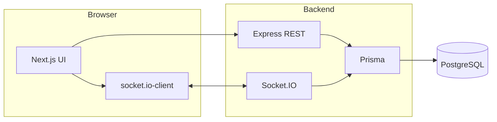

# Together — Couples connection MVP

Two partners share a private room and **live mood updates** (emoji + label + who sent it). The room accepts at most **two members**; mood sharing turns on only when both are present.

### iOS + Firebase (recommended for App Store + push)

The **native SwiftUI** app lives in [`ios/`](ios/README.md): Firebase Auth, Firestore realtime listeners, FCM device tokens, and [`firebase/functions`](firebase/functions/src/index.ts) to notify the partner when a mood is saved. Use bundle ID **`cz-app`** with your existing `GoogleService-Info.plist`.

### Web + Node (optional / legacy in this repo)

The stack below is the earlier browser MVP (Next.js + Postgres + Socket.IO).

## Architecture (web)

| Layer | Technology |
|--------|------------|
| Frontend | Next.js 15 (App Router), React 19, TypeScript |
| Realtime | Socket.IO (WebSocket + polling fallback) |
| Backend | Node.js, Express, TypeScript |
| ORM / DB | Prisma, PostgreSQL |
| Auth | Email + password (bcrypt), JWT (`Bearer` token) |



### Database schema (conceptual)

- **User** — `id`, `email`, `password_hash`, `created_at`
- **Room** — `id`, `invite_code`, `created_by`, `created_at`
- **RoomMember** — `id`, `user_id`, `room_id` (unique pair; max two members per room enforced in app logic)
- **MoodStatus** — `id`, `user_id`, `room_id`, `mood_type`, `updated_at` (one row per user per room)

Mood keys: `OVERTHINKING`, `HAPPY`, `SAD`, `ANGRY`, `TIRED`.

### Realtime flow

1. Client connects to Socket.IO with JWT in `auth.token`.
2. Client emits `room:join` with `roomId` (after REST join).
3. Server verifies membership, joins a Socket.IO channel `room:{id}`, sends current `room:state`.
4. On `mood:set`, server upserts `MoodStatus`, then broadcasts `room:state` to everyone in that channel.

REST `PATCH /rooms/:roomId/mood` is also available as a non-realtime fallback.

## Prerequisites

- Node.js 20+ recommended
- Docker Desktop (or another Docker engine) for local PostgreSQL

## Run locally

### 1. Start PostgreSQL

From the project root:

```bash
docker compose up -d
```

This exposes Postgres on `localhost:5432` with database `couples_app`, user `couples`, password `couples_dev` (development only).

### 2. Backend environment

```bash
copy backend\.env.example backend\.env
```

On macOS/Linux: `cp backend/.env.example backend/.env`

Edit `backend/.env` if needed. Defaults match `docker-compose.yml`.

### 3. Install dependencies

From the project root:

```bash
npm install
```

This installs the root dev tools and both workspaces (`backend`, `frontend`).

### 4. Run migrations & Prisma client

```bash
npm run generate
npm run migrate
```

For a non-interactive apply (e.g. CI or first boot without prompts), use:

```bash
npm run prisma:deploy -w couples-backend
```

The migration SQL lives in `backend/prisma/migrations/`.

### 5. Start dev servers

```bash
npm run dev
```

- API + WebSocket: [http://localhost:4000](http://localhost:4000) (`GET /health`)
- Web app: [http://localhost:3000](http://localhost:3000)

### 6. Try the flow

1. Register **user A**, create a room, note the **invite code** (or stay on `/room/{code}`).
2. In another browser (or incognito), register **user B**, go home, enter the code under **Join with code**.
3. When both are in the room, pick moods — updates should appear instantly for both.

Frontend reads `NEXT_PUBLIC_API_URL` (default `http://localhost:4000`). For a custom backend URL, create `frontend/.env.local`:

```env
NEXT_PUBLIC_API_URL=http://localhost:4000
```

### Optional: partner email when moods change (Gmail SMTP)

Useful if you ship the **web** app first and want a nudge in the partner’s inbox (not a substitute for iOS push, but works from any host).

1. In Google Account → **Security** → **2-Step Verification** (required), then create an **App password** for Mail.
2. In `backend/.env` set:

```env
NOTIFY_MOOD_EMAIL=true
PUBLIC_WEB_URL=https://your-deployed-frontend.example.com
SMTP_HOST=smtp.gmail.com
SMTP_PORT=465
SMTP_SECURE=true
SMTP_USER=youraddress@gmail.com
SMTP_PASS=your-16-char-app-password
```

Emails are sent **asynchronously**; failures are logged and do not block mood updates.

## Web first, iOS later — do they share data?

**Not automatically.** Today:

- The **browser app** uses **PostgreSQL** + this **Express** API.
- The **Swift** app uses **Firebase Auth** + **Firestore** (see `ios/` + `firebase/`).

So you can **deploy and run the website now** while you wait for a Mac. When you add the iOS app, you either:

- **iOS only**: focus users on the Apple app and wind down the web stack, or  
- **Both**: keep both, knowing accounts and rooms are **separate** unless you later build a bridge (e.g. single backend or sync). Common path is to treat the **native app as the long-term product** and keep the **web** as a fallback or admin/demo.

None of that blocks deploying Postgres + Node + Next.js today.

## GitHub + Vercel (recommended path for the web app)

1. **Initialize git** (if you haven’t): `git init`, then commit all tracked files.
2. **Create a repo on GitHub** and push (`main`). Step-by-step commands: **[`docs/DEPLOY.md`](docs/DEPLOY.md)**.
3. **Vercel** → New Project → import that repo → set **Root Directory** to **`frontend`** → add env **`NEXT_PUBLIC_API_URL`** = your public API URL (see below).
4. **API + database** are **not** on Vercel: run Express + Socket.IO + Postgres on Railway, Fly.io, Render, etc. (details in **`docs/DEPLOY.md`**). Set **`CORS_ORIGIN`** on the API to your Vercel site (e.g. `https://....vercel.app`).
5. Set **`PUBLIC_WEB_URL`** on the API to the same Vercel URL if you use mood **email** notifications.

`frontend/vercel.json` pins install/build for the Next.js app. **Do not commit** `GoogleService-Info.plist` to a public repo (use `ios/Together/GoogleService-Info.plist.example`).

## Production deployment (checklist)

Full walkthrough: **[`docs/DEPLOY.md`](docs/DEPLOY.md)**.

1. **PostgreSQL** — managed instance; set `DATABASE_URL`; run `prisma migrate deploy`.
2. **Backend** — long‑running Node host for Socket.IO: `npm run build && npm start` in `backend/` (see DEPLOY.md for migrate + start).
3. **Frontend (Vercel)** — root `frontend/`; env `NEXT_PUBLIC_API_URL`; align `CORS_ORIGIN` on API.
4. **Optional email** — `NOTIFY_MOOD_EMAIL` + `SMTP_*` on the API.
5. **Security** — strong `JWT_SECRET`, HTTPS, rate limits on auth / mood / join.

## Optional future features (not implemented)

- **Native push**: implemented for the **iOS + FCM** path; the **web** stack uses **email** optional hook above instead.
- Mood history / timeline
- Custom emoji sets per couple
- Lightweight chat or voice notes

## Project layout

```
backend/           Express API, Socket.IO, Prisma schema & migrations
frontend/        Next.js app (auth, home, room screen); vercel.json for Vercel
docs/DEPLOY.md    GitHub + Vercel + API hosting steps
docker-compose.yml Local Postgres
ios/             SwiftUI + Firebase (optional)
firebase/        Firestore rules + Cloud Functions (optional)
```

## License

MIT (adjust as needed for your product).
